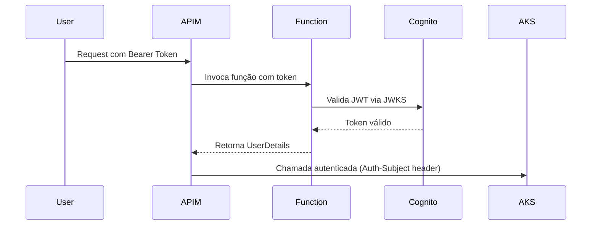

# 🔒 VideoCore Auth

<div align="center">

[](https://sonarcloud.io/summary/new_code?id=FIAP-SOAT-TECH-TEAM_videocore-auth)
[](https://sonarcloud.io/summary/new_code?id=FIAP-SOAT-TECH-TEAM_videocore-auth)
[](https://sonarcloud.io/summary/new_code?id=FIAP-SOAT-TECH-TEAM_videocore-auth)
[](https://sonarcloud.io/summary/new_code?id=FIAP-SOAT-TECH-TEAM_videocore-auth)

</div>

Azure Function serverless responsável pela autenticação e autorização de usuários do sistema VideoCore. Integrada com AWS Cognito para gerenciamento de identidade. Desenvolvida como parte do curso de Arquitetura de Software da FIAP (Tech Challenge).

<div align="center">
  <a href="#visao-geral">Visão Geral</a> •
  <a href="#arquitetura">Arquitetura</a> •
  <a href="#tecnologias">Tecnologias</a> •
  <a href="#fluxo-auth">Fluxo de Autenticação</a> •
  <a href="#executando-testes">Executando os Testes</a> •
  <a href="#repositorios">Repositórios</a> •
  <a href="#deploy">Fluxo de Deploy</a> •
  <a href="#instalacao">Instalação</a> •
  <a href="#contribuicao">Contribuição</a>
</div><br>

---

<h2 id="visao-geral">📋 Visão Geral</h2>

O **VideoCore Auth** é uma Azure Function que implementa o padrão **Lambda Authorizer**, responsável pela validação de tokens e identificação de usuários no sistema de processamento de vídeos.

### Fluxo Principal

1. Recebe **Bearer Token (JWT)** do cliente via APIM
2. Valida o token com o **AWS Cognito (JWKS)**
3. Extrai **claims** do token (subject, email, name)
4. Retorna dados do usuário para o **APIM**
5. APIM repassa a requisição autenticada para os microsserviços

### Características

- **Serverless**: Executa sob demanda, sem servidor dedicado
- **Always On**: Configurado para minimizar cold start
- **OAuth 2.0 + OIDC**: Autorização padronizada e identidade federada
- **Implicit Deny**: Qualquer falha de autenticação resulta em bloqueio
- **Caching**: Tokens cacheados no APIM para performance

---

<h2 id="arquitetura">🧱 Arquitetura</h2>

<details>
<summary>Expandir para mais detalhes</summary>

### 🎯 OAuth 2.0 + OpenID Connect (OIDC)

O sistema utiliza:

- **OAuth 2.0** para **autorização** baseada em tokens
- **OpenID Connect (OIDC)** para **identidade**, fornecendo claims padronizadas do usuário

O **AWS Cognito** atua como **Identity Provider (IdP)**, emitindo **JWTs compatíveis com OIDC**, enquanto a Azure Function valida e aplica regras de autorização.

### 🎯 Padrão Lambda Authorizer

```
Cliente → APIM → Azure Function → Cognito
                      ↓
              Validação JWT (JWKS)
                      ↓
              Retorna claims
                      ↓
           APIM → Microsserviço
```

### 🔑 Tokens e Claims

- **Access Token (JWT)**: Utilizado para autorização
- **ID Token (OIDC)**: Contém identidade do usuário
- **Claims validadas**:
  - `sub` (subject)
  - `email`
  - `name`
  - `exp` (expiração)

### 🔐 Validações Realizadas

- **Assinatura do token** via JWKS público da AWS
- **Conformidade com OAuth 2.0 / OIDC**
- **Expiração do token**
- **Claims obrigatórias** (subject, email)

### 📦 Estrutura do Projeto

```
function/
├── VideoCoreAuth/
│   ├── VideoCoreAuth.cs      # Endpoints da Function
│   ├── Program.cs            # Entry point e DI
│   ├── Config/               # Configurações e OpenAPI
│   ├── DTO/                  # Data Transfer Objects
│   ├── Model/                # Modelos de domínio
│   ├── Presenter/            # Formatação de respostas
│   ├── Services/             # Integração com Cognito
│   └── Utils/                # Utilitários AWS
└── VideoCoreAuth.Tests/      # Testes unitários
```

</details>

---

<h2 id="tecnologias">🔧 Tecnologias</h2>

| Categoria | Tecnologia |
|-----------|------------|
| **Runtime** | .NET 9 |
| **Cloud** | Azure Functions |
| **Identity** | AWS Cognito |
| **Gateway** | Azure APIM |
| **Testes** | xUnit, FluentAssertions |
| **Qualidade** | SonarCloud |
| **IaC** | Terraform |
| **CI/CD** | GitHub Actions |

---

<h2 id="fluxo-auth">🔄 Fluxo de Autenticação</h2>

<details>
<summary>Expandir para mais detalhes</summary>

### Validação de Token



### Resposta da Function

```json
{
  "subject": "a1b2c3d4-e5f6-7890-abcd-1234567890ef",
  "name": "João da Silva",
  "email": "joao.silva@example.com"
}
```

### Resposta de Erro

```json
{
  "timestamp": "2025-10-02T09:30:00Z",
  "status": 401,
  "error": "Unauthorized",
  "message": "Token inválido ou expirado"
}
```

</details>

---

<h2 id="executando-testes">🧪 Executando os Testes</h2>

```bash
# Navegar para a pasta da solution
cd function

# Restaurar dependências
dotnet restore VideoCoreAuth.sln

# Executar todos os testes
dotnet test VideoCoreAuth.sln

# Executar com cobertura de código
dotnet test VideoCoreAuth.sln --collect:"XPlat Code Coverage"

# Executar com output detalhado
dotnet test VideoCoreAuth.sln --logger "console;verbosity=detailed"
```

---

<h2 id="repositorios">📁 Repositórios do Ecossistema</h2>

| Repositório | Responsabilidade | Tecnologias |
|-------------|------------------|-------------|
| **videocore-infra** | Infraestrutura base (AKS, VNET, APIM, Key Vault) | Terraform, Azure, AWS |
| **videocore-db** | Banco de dados | Terraform, Azure Cosmos DB |
| **videocore-auth** | Autenticação (este repositório) | .NET 9, Azure Functions, Cognito |
| **videocore-frontend** | Interface web do usuário | Next.js 16, React 19, TypeScript |
| **videocore-reports** | Microsserviço de relatórios | Java 25, Spring Boot 4, Cosmos DB |
| **videocore-worker** | Microsserviço de processamento de vídeo | Java 25, Spring Boot 4, FFmpeg |
| **videocore-notification** | Microsserviço de notificações | Java 25, Spring Boot 4, SMTP |

---

<h2 id="deploy">⚙️ Fluxo de Deploy</h2>

<details>
<summary>Expandir para mais detalhes</summary>

### Pipeline

1. **Pull Request** → CI: Build .NET, Testes, SonarCloud, Terraform Plan
2. **Revisão e Aprovação** → Mínimo 1 aprovação de CODEOWNER
3. **Merge para Main** → CD: Deploy Azure Functions

### Autenticação

- **OIDC**: Token emitido pelo GitHub
- **Azure AD Federation**: Confia no emissor GitHub
- **Service Principal**: Autentica sem secret

### Ordem de Provisionamento

```
1. videocore-infra          (AKS, VNET, APIM)
2. videocore-db             (Cosmos DB)
3. videocore-auth           (Azure Function Authorizer - este repositório)
4. videocore-reports        (Microsserviço de relatórios)
5. videocore-worker         (Microsserviço de processamento)
6. videocore-notification   (Microsserviço de notificações)
7. videocore-frontend       (Interface web)
```

### Proteções

- Branch `main` protegida
- Nenhum push direto permitido
- Todos os checks devem passar

</details>

---

<h2 id="instalacao">🚀 Instalação e Uso</h2>

### Desenvolvimento Local

```bash
# Clonar repositório
git clone https://github.com/FIAP-SOAT-TECH-TEAM/videocore-auth.git
cd videocore-auth/function

# Configurar variáveis de ambiente
cp VideoCoreAuth/env-example VideoCoreAuth/.env

# Executar localmente
func start
```

---

<h2 id="contribuicao">🤝 Contribuição</h2>

### Fluxo de Contribuição

1. Crie uma branch a partir de `main`
2. Implemente suas alterações
3. Execute os testes: `dotnet test VideoCoreAuth.sln`
4. Abra um Pull Request
5. Aguarde aprovação de um CODEOWNER

### Licença

Este projeto está licenciado sob a [MIT License](LICENSE).

---

<div align="center">
  <strong>FIAP - Pós-graduação em Arquitetura de Software</strong><br>
  Tech Challenge 4
</div>
- **videoCoreStartSubscription:** consultar output terraform: `apim_videocore_start_subscription_key`
    > ℹ️ Ou capturar via `Azure Console`
- **reportsAuthorizationHeader:** consultar `access_token` retornado pelo `Cognito` pós autenticação